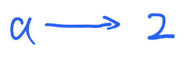
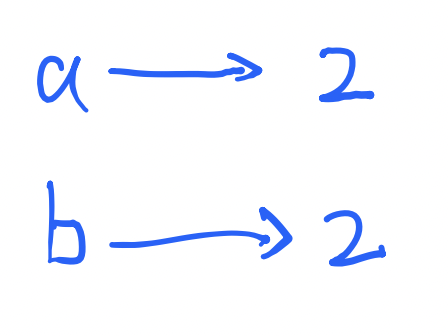
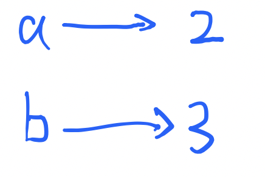
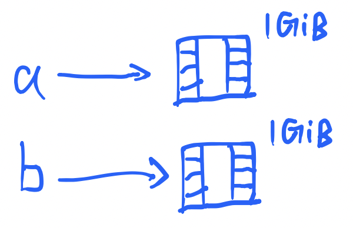
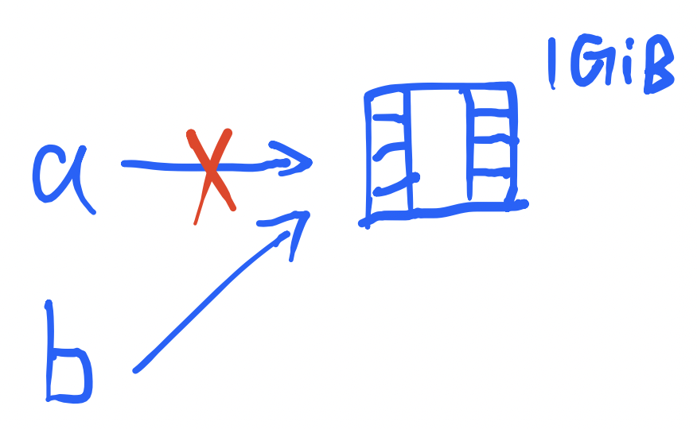

# STL & Modern C++

## Move Semantics

为了理解move semantics的必要性，我们先回顾一下变量的概念。

假设现在我们有一个整数类型的变量`int a = 2;`



我们再声明一个变量`int b = a;`



这时候`b`拷贝了`a`的值，他们是互相独立的。也即，`b=3`不会影响`a`的值。



但是这个独立性的代价是，它在内存中需要占双份的空间！如果我们从头再来，但是换成一个比较大的变量，比如视频`Video a = make_video();`


这时候拷贝`b=a`



内存中就会有两份变量，总共空间占用2GiB。这会导致问题吗？

```cpp
class Folder {
 public:
  Video video;
  void save_video(Video a) {
    video = a;
    // (1)
  }
};
```

考虑`save_video()`函数的调用。调用结束后，我们理想的结果是`video`变量中存储了一份视频，而且整个内存中只有这个地方存储了这一份视频。但是实际上，在(1)这个瞬间，内存中有两份视频！一份存在`video`里面，一份存在`a`里面。虽然在`save_video()`函数结束后，`a`会被析构并释放内存，但是我们并没有任何存储两份视频的必要。拷贝是需要花费时间的，尤其是数据量庞大的变量，或者是构造复杂的对象。

还有一个类似的场景更加隐蔽：

```cpp
Video make_video() {
  // code to make video
  // ...
}

int main() {
  Video a;
  a = make_video(); // (2)
}
```

在(2)这一行，我们先创建了一个视频，然后赋值给`a`。这个操作看似没有什么问题，但是它和上面的`a=b`有什么不同吗？对于编译器来说，它都是一个`a=`赋值，因此要进行一次拷贝。拷贝结束后，编译器再把`make_video()`生成的视频析构掉，只保留一个`a`。在`make_video()`返回的视频被析构之前，仍然有一个瞬间我们占用了双份的内存。

为了解决这个问题，C++11引入了move semantics，我们可以选择**移动**一个变量而不是**拷贝**一个变量。



可以发现，如果使用移动，会破坏前面提到的“独立性”，因为`a`里面的数据没了（或者和`b`共用，那么修改`b`就会影响`a`）。因此我们要保证被移动的变量（`a`）后面不会再被使用。这些变量也可以认为是即将要被销毁的变量。

C++11中的语法将“即将要被销毁的变量” 标记为rvalue reference：`Video&&`。它和普通的reference一样，仍然指向原来的数据区域，但它的含义变了：它指向的数据即将被销毁。编译器只允许把即将要被销毁的变量交给这个标记。

具体来说，如果我们定义了两个`=`号的重载：

```cpp
void operator = (const Video &that) {
  // (3)
}
void operator = (Video&& that) {
  // (4)
}
```

我们发现第一个函数只能接受一个不可变的变量，也就是在`b=a;`赋值的时候`a`以`const`形式接收，不允许对`a`做出任何修改。那么(3)处只能老老实实地拷贝`a`里面的数据到`b`。

但是第二个函数是`Video&&`，一个rvalue reference，它的语义是这个变量`that`不仅能修改，你还可以随意销毁里面的数据。因此我们可以把`a`里面的数据直接给`b`，不用拷贝，也不会出现双份内存的问题。

编译器会根据`b=a`中`b`的`a`的状态自动选择调用(3)还是(4)：如果`a`不需要了，可以扔掉，那么就优先选择(4)，这样可以直接移动，减少一次拷贝；但是如果`a`还有用，那么就只能选择(3)，因为(4)会把`a`里面的数据移走，`a`的数据就用不了了。

那么这个场景就解决了：

```cpp
Video make_video() {
  // code to make video
  // ...
}

int main() {
  Video a;
  a = make_video(); // (2)
}
```

函数返回值编译器一般都会认为是rvalue，一个可移动的变量，因为它马上会被销毁。比如：

```cpp
int main() {
  make_video();
}
```

这个情况下，我们甚至不使用这个返回值，返回之后立刻销毁，因此没有任何保留的必要，我们标记为`Video&&`。那么编译器就会自动选择(4)，移动。这样就省掉了一次拷贝。

这个情况会麻烦一点点：

```cpp
class Folder {
 public:
  Video video;
  void save_video(Video a) {
    video = a;
    // (1)
  }
};
```

编译器不知道我们是否在(1)处还要继续使用`a`，因此编译器不会自动把`a`当成可销毁变量。为了让强制编译器使用移动而不是拷贝，我们可以使用`std::move()`：

```cpp
class Folder {
 public:
  Video video;
  void save_video(Video a) {
    video = std::move(a);
  }
};
```

这样就解决问题了。

`std::move()`不会对数据进行任何操作，它只有一个作用：标记某个变量为即将被销毁的变量，也就是返回一个`Video&&`类型，但是数据保持不变，甚至用的是同一块内存地址。这也会导致一个问题，就是这个原变量的析构函数仍然会被调用一次：

```cpp
int main() {
  Video a = make_video;
  Video b;
  b = std::move(a);
} // (5)
```

(5)处不仅仅调用了`b`的析构函数，还调用了`a`的析构函数！所以即使我们在(4)中使用了`a`的数据，我们仍然要保证`a`是一个合法的、能够被析构的变量。

```cpp
void operator = (Video&& that) {
  // (4)
}
```

### FAQ

- 为什么叫rvalue？
    - 名字来源于赋值语句：`b = a;`，左手边的就是lvalue，右手边的就是rvalue
    - lvalue的要求可修改，因此一般是某些变量或者引用，但不能是常量（`const`）
    - rvalue的要求低一些，可以是常量、函数返回值，甚至是另一个lvalue。
- 为什么一个rvalue reference是一个lvalue？
    - 这听起来很迷惑，但如果我们回顾一下rvalue reference的作用，就不难理解这个事情。rvalue refernce的目的是为了区分出那些“即将要被销毁的变量”：

    ```cpp
    void operator = (Video&& that) {
      // (4)
    }
    ```

    “区分”这一步在调用`operator=()`函数的时候就已经完成了，在函数体(4)内，`that`就只是一个正常的变量。因此在(4)中任何对`that`的引用仍然是lvalue reference。这意味着我们有时候仍然需要强调这个变量可移动：

    ```cpp
    void operator = (Video&& that) {
      this->data = std::move(that.data);
    }
    ```

- `Video&& a = make_video();`会发生什么？
    - 我们前面虽然提到一个函数的返回值一般会被立刻销毁，但是这里是一个C++的特例（C++真的有很多特例……）：[extended lifetime of a temporary](https://en.cppreference.com/w/cpp/language/reference_initialization#Lifetime_of_a_temporary)。这个返回值会被延长到`a`这个引用变量的生命周期结束。也就是说，`a`的生命周期结束之前，返回值不会被销毁。这样就可以安全地使用`a`了。

    `const Video& a = make_video();`也是类似的原理，不过这里的`a`是一个`const`，不能修改。

    当然，这种写法并不是很常见，也不是很推荐，因此不需要深究。

- 如何判断`this`是lvalue还是rvalue？
    - 举个例子，`a.clone()`和`make_video().clone()`就可以有不同的实现，因为前者需要真的做一次拷贝，但是后者是一个函数返回值，反正很快就要被销毁，不如直接拿过来用。

    区分的办法是用C++的qualifier：

    ```cpp
    Video clone() & {
      // ...
    }
    Video clone() && {
      // ...
    }
    ```

    `&`表示`this`是一个lvalue，`&&`表示`this`是一个rvalue。这样我们就可以根据`this`的类型来选择不同的实现了。

    除此之外还有一些其他的qualifier，比如

    ```cpp
    Video clone() {
      // 没有qualifier
    }
    Video clone() const {
      // ...
    }
    Video clone() volatile {
      // ...
    }
    ```

    没有qualifier的区别是，它可以同时作用于lvalue和rvalue。其他qualifier的讨论超出了本文的范畴。
