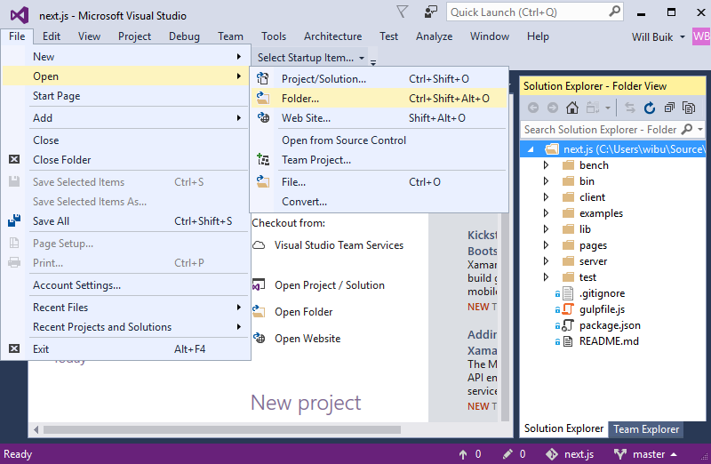
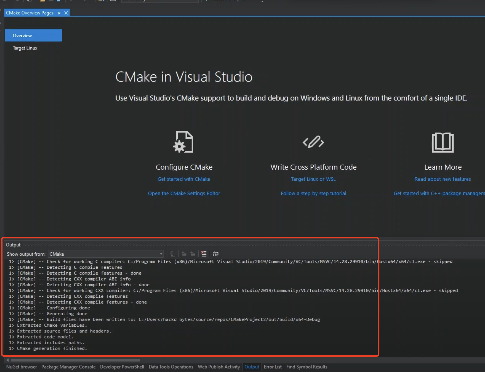
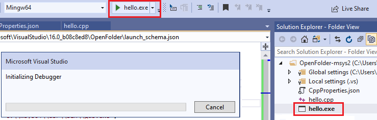
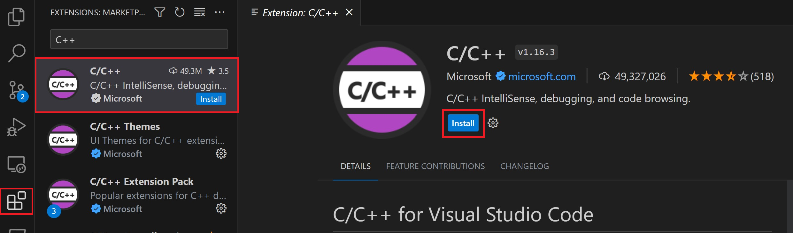
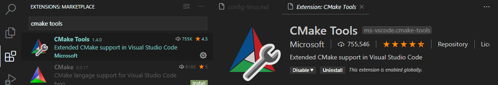
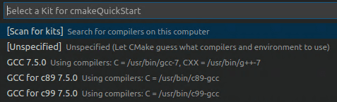
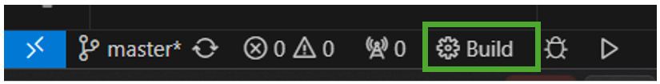

# CMake

我们一般会把一个文件夹当成一个repository，在这个repository的根目录下放一个`CMakeLists.txt`，表示这是一个C++项目并做相关的配置。
这个文件夹包含了所有相关代码。
而大部分IDE中，支持“打开文件夹”，就是把某个文件夹当成一个项目打开。
打开之后，IDE会自动读取文件夹下的文件并进行配置。
请注意，是打开到带有`CMakeLists.txt`的文件夹，如homework 2下的各个子文件夹，而不是整个homework 2文件夹。

## Visual Studio

VS2022在安装C++组件的时候默认带上CMake。我们只需要“文件”-“打开”-“文件夹”



等待CMake配置完成



然后就可以运行了：



## VSCode集成

如果在VSCode中使用CMake，需要安装两个插件：[C/C++](https://marketplace.visualstudio.com/items?itemName=ms-vscode.cpptools)和[CMake Tools](https://marketplace.visualstudio.com/items?itemName=ms-vscode.cmake-tools)。另外，你需要自行安装编译器和CMake。




按下<kbd>Ctrl</kbd>+<kbd>Shift</kbd>+<kbd>P</kbd>，输入`CMake: Select a Kit`，选择你安装好的编译器：



界面底下就可以点击编译(build)运行(▶️)了：



点击那个小虫图标可以开始调试。

更多参考[Get started with CMake Tools on Linux](https://code.visualstudio.com/docs/cpp/cmake-linux)

## MTd_StaticDEBUG不匹配MDd_DynamicDebug的解决办法

修改`CMakeLists.txt`，在其中加入一行：

```cmake
set(CMAKE_CXX_STANDARD 14)

set(gtest_force_shared_crt on)  # 新增的是这一行
add_subdirectory(../external/googletest gtest)
```
