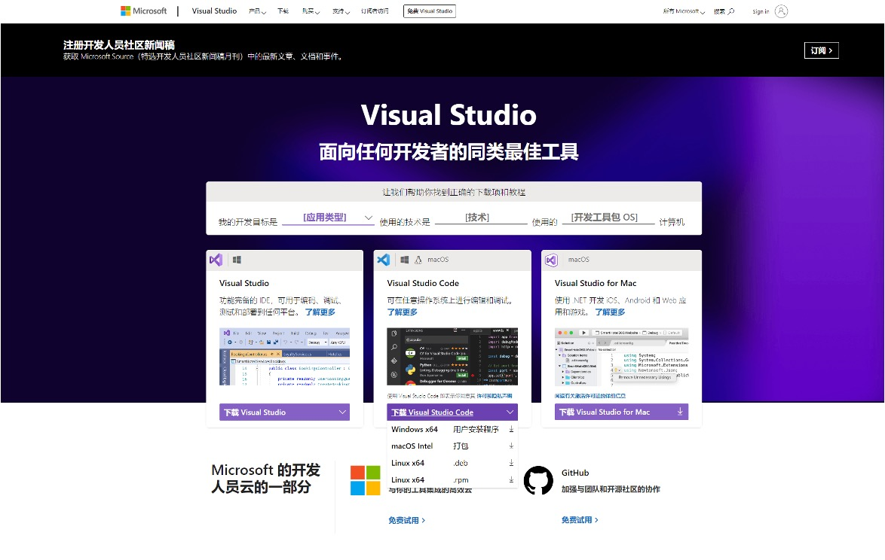
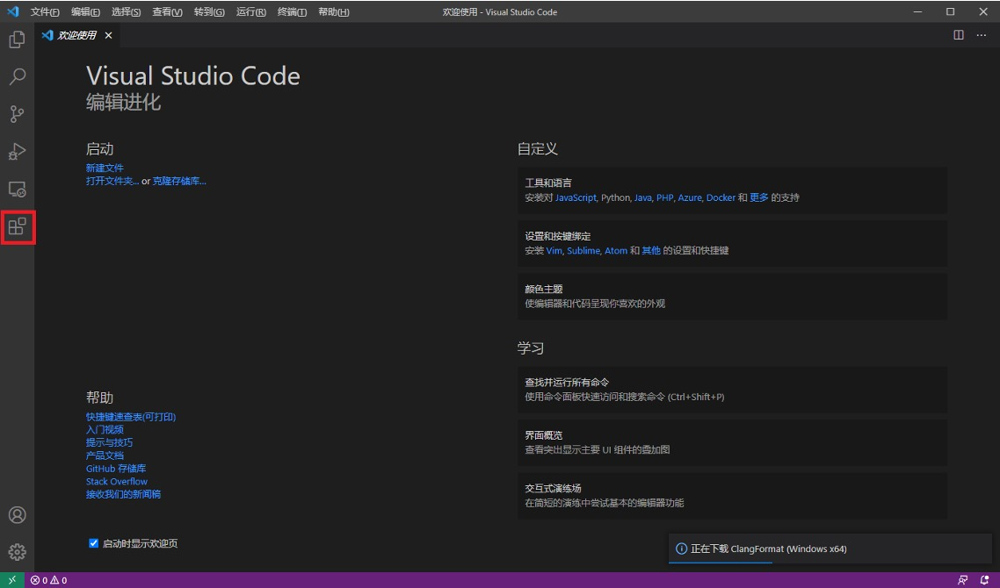

# 配置开发环境

开发环境可以大体划分为三部份：系统、IDE和编译器。
如果要开始写代码，你需要选一个套餐。
我们的教程仅提供部分的组合，
如果你使用这些组合以外的选项，你需要做好一定程度的自主摸索的准备。
孰优孰劣是一个主观问题，而且大部份工具都在不断更新，
大家根据自己的偏好和实际情况选择即可。
需要注意的是，
开发环境以效率为重，不建议大家将颜值当作决定的第一因素。

## 组建你的技术栈

### 你用的是什么系统？

* 如果你的电脑是苹果的电脑，则你用的是MacOS。
* 如果你的屏幕底部有一个任务栏，最左边是开始按钮，
打开的程序会在任务栏上显示出来，
那么你使用的是Windows。
* 使用其他系统的同学通常都知道自己使用的是什么系统。

系统已经安装在你的电脑上了，一般无需更改。当你发现你的操作系统很不顺手时（一般只有在Windows上会出现这种现象），可以考虑更换成Linux、安装Linux虚拟机或安装WSL。WSL是一个轻量的虚拟机，能让你在Windows上方便地运行Linux程序，和使用正经的Linux几乎没有区别。

### 选择一个IDE

IDE(Integrated Development Environment)是你编写代码的地方。
源代码其实是文本文件，理论上你可以用任何文本编辑器来编写代码，
比如Windows自带的记事本，但是这样做效率很低。
IDE能够提供代码高亮、自动补全、优化代码格式、代码分析等功能，
能够大大提高你的编程效率。

不过，有两个文本编辑器值得一提：Vim和Emacs。
这两个编辑器的诞生较早，可以使用键盘完成所有操作，
因此在服务器上比较常用。
而且，一旦学会它们的用法，这些习惯就几乎摆脱不掉，
你会发现你在其他编辑器上的操作速度都变慢了。
因此大部份的IDE会提供插件来支持这两个编辑器的快捷键。
它们的难度曲线较高，编程初期时不需要学习，只要略有耳闻即可。

下面介绍目前主流的IDE，如果你已经决定好使用什么IDE，可以跳过。

* [Visual Studio Code](https://code.visualstudio.com/)：免费，有无法替代的killer feature:
    * 插件生态极其丰富，通过插件能支持大部份编程语言
    * Remote系列插件支持远程开发，如服务器、虚拟机、Docker等环境
* [Jetbrains](https://www.jetbrains.com/)系列：商用（学生免费），每一种语言都有一款对应的IDE（界面基本一样），主要特色是代码分析能力强。
    * 顶级Java(IntelliJ IDEA)和Python(PyCharm)支持。
* [Visual Studio](https://visualstudio.microsoft.com/)：大部份功能免费（Community版），能且仅能在Windows上使用。
    * 顶级C#和.NET支持。
    * 在Windows上支持最好的C++编译器只能通过Visual Studio安装。

<details markdown>
<summary>
助教对C++ IDE的主观推荐
</summary>

> Yulong Hui<br>
2022.9.13

事先声明：对于各种编辑器和IDE的优劣评价，是编程领域经久不衰的吵架话题。我在此仅主观地为⼤家介绍⼀些
常⽤的IDE（当然，我的观点也是⽬前较主流的观点）。

1. ⾸先推荐的IDE是: Clion (https://www.jetbrains.com/clion/). Clion是Jetbrains系列的软件之⼀，其功能⾮常强⼤，⽆论是mac还是windows系统，它都是⼤型 C++ 项⽬开发者⾸选的主流IDE。Clion理论上对学⽣免费，但是我⽬前并不确定⼤家的清华邮箱还能否认证成功 (https://www.jetbrains.com/community/education/#students)。如果⼤家的认证存在较多麻烦问题，可以考虑使⽤其他的IDE（或者问助教找妙招）。

    Clion的安装和配置教程可以⾃⾏在⽹上搜索，相关资源⾮常多，⽐如（https://blog.51cto.com/u_15049778/3946377）。

2. 其他可选IDE：

    1. 除Clion之外，对于Windows⽤户，我们推荐⼤家使⽤ Visual Studio (注意，还有⼀个东⻄叫 Visual Studio Code，这是两个完全不同的软件)。
    2. 除Clion之外，对于mac⽤户，可以使⽤Xcode，在App Store⾥就能直接下载 （不过该软件的争议⽐较多，我本⼈没有使⽤过，不做过多评价）。

3. 在⽬前的⽣产⼯作中，Visual Studio Code (简称VSCode)，是使⽤最为⼴泛的编程软件。

    （PS: 如果⼤家去FIT楼的研究⽣⼯位转⼀圈，会发现: 80%以上的⼈，电脑屏幕都是VSCode的界⾯）

    VSCode本质上是⼀个编辑器（editor)，但是它拥有⾮常多的强⼤插件，在配置好compiler并安装⼀些插件后（⽐如 c++ extension)，VSCode也可以像IDE⼀样使⽤。

    但是，我把VSCode放在第三位的原因在于：它在运⾏c++之前，需要配置 task.json, launch.json等⽂件，较为麻烦，对于初学者和⼤型项⽬并不友好。如果有兴趣和毅⼒克服配置的困难，VSCode⼀定是⾮常不错的编程⼯具。

4. 剩下的⼀些，⼤家可能会听说并尝试使⽤的IDE：

    Dev C++, Codeblocks 等等

    这些IDE往往很受初学者欢迎，但是在2022年，它们已经很过时了。⾄少在真正的⽣产开发⼯作中，没有听说身边有哪些⼈还在使⽤这⼀类IDE，因此，个⼈并不推荐⼤家使⽤它们。

</details>

<details markdown>
<summary>
助教对C++ IDE的主观推荐2
</summary>

> Zijian Lv
> <br>
> 2021-??-??

Visual Studio 2022是目前最新版本的Visual Studio，是Windows平台最强大的IDE

* 新版Visual Studio拥有更强大的工具包，更舒适的安装体验以及使用体验。
* 新版Visual Studio拥有一个可以帮助你实时更新和安装组件的安装器
* 新版Visual Studio携带的编译工具更适合当前主流Windows版本的环境
* Visual Studio 2022升级到了64位

Visual Studio Code是一款功能强大的编辑器

* 这款编辑器十分轻量级，使用体验流畅
* 这款编辑器支持Windows/Linux/macOS三种平台
* 这款编辑器拥有丰富的扩展组件，可以通过配置适配不同的开发需求


Xcode 是苹果公司提供的 IDE

* Xcode 可以用于开发macOS, iOS, iPadOS等平台的应用程序

</details>


<details markdown>
<summary>
助教对C++ IDE的主观推荐3
</summary>

> Kai Su ([@sshockwave](https://github.com/sshockwave))
> <br>
> 2023-01-24

上面的就是我的主观推荐（

</details>

### 编译器篇

编译器是将源代码转换成机器代码的程序，
我们写完代码之后，要通过它们编译之后才能运行。
同一种语言的编译器大体上是相同的，
基本不会影响我们的开发。

需要留意的是，不同编译器的表现可能会有所不同。
因此，在自己电脑上能编译通过的程序，
在别人（比如助教）的电脑上就可能无法正确编译。
这是常见问题，无需大惊小怪。

如果你对编译器感兴趣，我们也提供一个简要介绍：

> 目前的主流C++编译器有MSVC（Visual Studio附带）、GCC和Clang。
>
> MinGW、TDM-GCC、MSYS2、Cygwin都是把GCC从Linux移植到Windows的产物，容易水土不服、功能缺失，不推荐使用。

## 配置教程

我们的指南目前覆盖了以下C++组合：

* Windows + Visual Studio
* Windows + WSL + Visual Studio Code + GCC
* Linux + Visual Studio Code + GCC
* macOS + Visual Studio Code + Clang

### 系统准备

=== "Windows + WSL"

    根据[官方安装教程](https://learn.microsoft.com/zh-cn/windows/wsl/install)，安装**WSL2**，推荐选择Ubuntu发行版。该发行版的驱动支持较好，工具齐全。

    安装完成后，请查看"Linux"部分。

=== "Linux"

    你需要确认你使用的发行版，不同的发行版通常有不同的包管理器，需要用不同的指令安装。

    常见发行版对应的包管理器是：

    <style>#dist-table td:nth-child(2) {
        text-align: center !important;
        vertical-align: middle !important;
    }
    </style>

    <table markdown id="dist-table">
    <tbody markdown>
    <tr>
    <th>发行版</th><th>包管理器</th>
    </tr>
    <tr markdown><td>:simple-ubuntu: Ubuntu</td><td rowspan=2>apt</td></tr>
    <tr markdown><td>:simple-debian: Debian</td></tr>
    <tr markdown><td>:simple-alpinelinux: Alpine Linux</td><td>apk</td></tr>
    <tr markdown><td>:simple-archlinux: Arch Linux</td><td>pacman</td></tr>
    <tr markdown><td>:simple-centos: CentOS</td><td rowspan=2>yum</td></tr>
    <tr markdown><td>:simple-fedora: Fedora</td></tr>
    <tr markdown><td>:simple-opensuse: OpenSUSE</td><td>zypper</td></tr>
    </tbody>
    </table>

=== "其他"

    无需操作。

### 安装编译器

=== "Visual Studio"

    > Zijian Lv [@LazyJazz](https://github.com/LazyJazz)
    > <br>
    > 2021-??-??

    由于教材出版年代较早，教材中推荐使用的早期Visual Studio版本已经逐渐被淘汰，且在最新的Windows操作系统环境中配置可能会遇到问题。

    在此推荐安装最新版的 Visual Studio 2022 该版本附带了安装器，可以自由地配置需要的组件，并可以即时获取更新，十分方便。

    首先，请前往 [visualstudio.com](https://visualstudio.microsoft.com/) 获取合适的 Visual Studio 2022 版本。

    个人使用下载 Community 版本即可，该版本提供给个人免费试用，无需激活码。

    

    安装程序下载完毕后，双击运行安装程序。安装程序会先安装Visual Studio Installer，即安装器。

    安装器安装完成后，会进入如下图界面，需要选择需要的组件。

    C++程序勾选 “使用C++的桌面开发”即可，然后点击右下角“安装”。

    

=== "GCC"

    我们这里需要少量使用命令行，如有疑问请参考我们的[命令行](../shell)教程。

    在类Linux的环境中安装GCC非常简单。我们以Ubuntu/Debian为例，其他发行版请参考对应的包管理器。

    我们全程在命令行中操作。安装过程需要管理员权限，如果出现了需要密码的情况，请输入密码。

    我们先更新一下包列表：

    ```
    sudo apt update
    ```

    然后安装`g++`（GCC中的C++编译器）：

    ```
    sudo apt install g++
    ```

    最好再安装一下`gdb`，方便调试：

    ```
    sudo apt install gdb
    ```

    现在已经安装完成，可以通过以下命令输出编译器版本，确认安装成功：

    ```
    g++ --version
    ```

=== "macOS + Clang"

    我们这里需要少量使用命令行，如有疑问请参考我们的[命令行](../shell)教程。

    打开“终端”应用，输入以下命令：

    ```
    xcode-select --install
    ```

    根据提示操作完成即可。

    以下命令如果输出了编译器版本，则可以确认安装成功：

    ```
    clang --version
    ```

### 安装IDE

=== "Visual Studio"

    我们在上一步中已经将Visual Studio的核心组件顺便安装完成，因此不需要进一步操作。

=== "Visual Studio Code"

    > Zijian Lv [@LazyJazz](https://github.com/LazyJazz)
    > <br>
    > 2021-??-??
    > <br>
    > Kai Su [@sshockwave](https://github.com/sshockwave)
    > <br>
    > 2023-01-23

    Visual Studio Code是一个轻量级的，跨平台的，功能强大的编辑器（不自带编译器）。

    它最强大的功能是可以安装适用于各种需求的扩展组件

    程序可以从[官网](https://code.visualstudio.com/)下载

    选择对应你操作系统的版本即可

    

    VSCode 安装过程符合一般程序安装过程，在此不再特殊说明。

    安装完成后打开 VS Code 进入右图界面

    点击左侧“扩展”按钮（图标是四个方格，如右图框出位置）

    

    推荐安装的扩展：

    * Chinese (Simplified) Language Pack for Visual Studio Code
    * C/C++
    * C/C++ Compile Run

    这些组件的自带说明都非常详细

    安装好这些组件后，你就可以随意用 VSCode 打开 .cpp 文件进行编程了。

    如果你使用WSL，则需要安装一个额外的插件：

    * Remote - WSL

    安装好这个插件后，选择左下角的绿色按钮，选择“Remote-WSL: New Window”，即可在WSL中打开VSCode。这时你打开的所有文件、terminal都在WSL中，而不是Windows，因此可以获得一个接近Linux的良好体验。

### 试着创建一个项目（可选）

在课程中，我们通常会提供创建好的项目，
不需要自己操作。
如果你想创建一个自己的C++项目，不妨跟着教程试一试。

=== "Visual Studio"

    > Zijian Lv [@LazyJazz](https://github.com/LazyJazz)
    > <br>
    > 2021-??-??

    安装完毕后，打开Visual Studio 2022。（可以在开始菜单中找到，或者利用Windows搜索栏输入 “Visual Studio 2022” 查找）

    

    打开 Visual Studio 2022 后，进入下图界面

    选择“创建新项目”

    首次打开可能需要配置主题颜色，登录微软账号等。按自己需求操作即可。

    

    在“创建新项目”界面，找到“Windows 桌面向导”
    可以利用上方筛选选项和搜索栏辅助寻找。

    注意，若在安装时未勾选 “使用C++的桌面开发”则无法找到该选项。

    点击“下一步”

    

    进入右图界面，你需要给你的项目起一个名字，并选择一个创建项目的位置

    点击“创建”

    

    在上一步点击“创建”后，弹出右图窗口

    应用程序类型选择：“控制台应用程序(.exe)”

    勾选“空项目”

    点击“确定”

    

    进入开发界面后，找到“解决方案资源管理器”（默认是在界面右侧）

    右键“源文件”

    选择“添加-新建项”
    
    

    选择“C++文件(.cpp)”

    在下方给你的源文件命名并点击“添加”

    

    添加源文件后会自动返回开发界面，然后就可以在编辑器中编写你的程序了。

    编写完程序之后，按“Ctrl+F5”编译运行。即可看到程序运行的窗口。

    

=== "Visual Studio Code"

    打开Visual Studio Code，选择"Open Folder"打开一个文件夹。

    这个文件夹就是你的项目文件夹（被称为workspace），
    所有的操作都在里面进行。

    你可以对Visual Studio Code进行配置，配置如果是workspace级别都话，会存放在这个文件夹下的`.vscode`文件夹中。

    如果你在上一步安装了C++ Compile Run插件，那么你可以随便写一个`.cpp`文件，然后按<kbd>F6</kbd>（Mac为<kbd>Cmd</kbd>+<kbd>r</kbd>）运行。这个插件在工程中并不常用，仅作为一个简单的编译运行测试工具，如有需要请查阅其官方文档。
