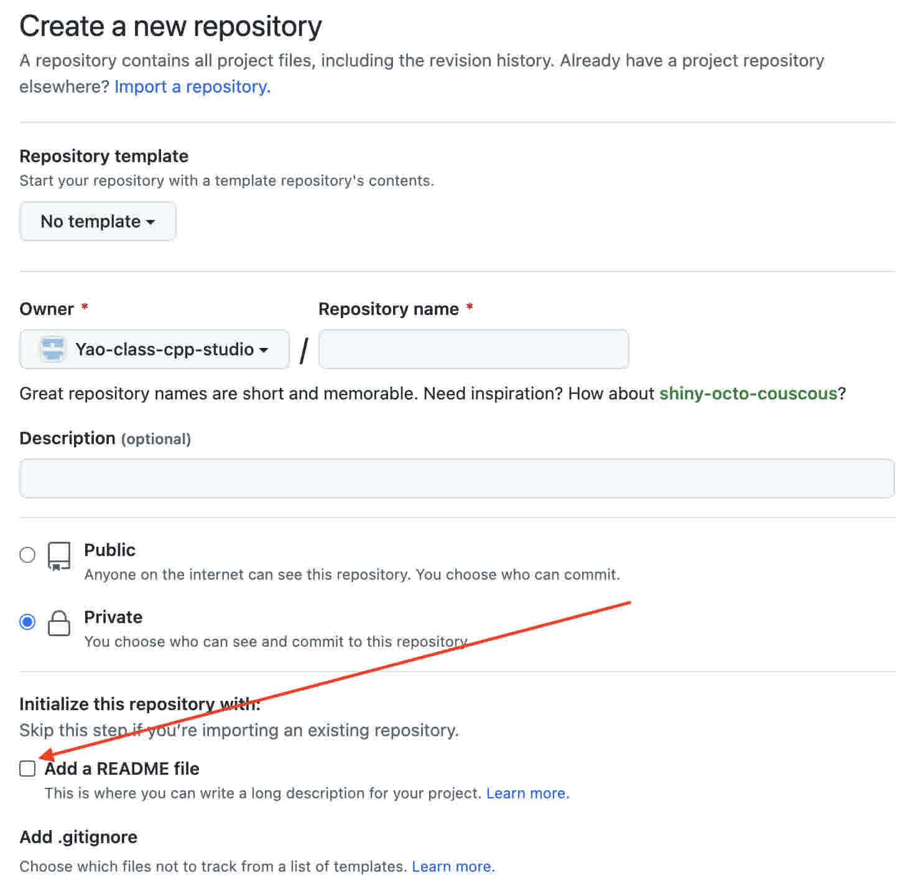

# Git新手入门

Git是一个版本管理软件。我们为什么需要版本管理？

1. 如果自己改错了代码，可以随时找到之前的版本。
2. 多人协作时，如果两个人同时修改了一份代码，我们需要知道每个人具体修改了什么，才能把两个人的工作整合到一起。
3. 程序出bug时，我们需要找回导致这个bug的精确版本。对代码的任何改动都有可能导致错误无法复现。

Git是目前最常用的版本管理软件。开始一个新项目的时候，我们首先考虑使用git；如果发现git实在不适合这个具体的项目场景，才考虑它的替代品。

## 基础中的基础

我们一般把一个项目放在一个文件夹里，用git对这个文件夹进行管理。
在git中，我们把这个文件夹叫做“仓库”（repository）。
只有在仓库中，我们才能使用git的各种功能。
仓库里面的任何文件的变动都可以被git记录下来。

Git中的一个核心概念是“commit”。
虽然这个词的本意是承诺、做出决定，但是在git中我们可以认为它和“版本”是一个意思。
我们修改仓库中的文件时，git还暂时**不会**记录下我们的修改。
只有我们用git进行操作，把我们的修改commit到仓库了之后，git才会记住我们做的改动。

## 创建仓库

[GitHub](https://github.com)是目前最大的代码托管网站。在这个小节中，我们将创建一个仓库并使用GitHub备份一份我们的代码。请先在GitHub上创建一个帐户，然后继续往下看。

你还需要安装一个git客户端。就笔者个人意见而言，GitHub Desktop是目前最简单也最好用的git客户端。在个别情况下我们需要使用git命令行进行辅助，但是对于日常开发，GitHub Desktop能大幅提高我们的生产力。
请[下载GitHub Desktop](https://desktop.github.com/)并安装、登录。

> GitHub Desktop目前不支持Linux，在Linux上请查阅[进阶-Git的命令行操作](./command.md)。

接下来我们建立第一个仓库。
在GitHub页面中选择[New Repository](https://github.com/new)，起一个仓库名字，选择“Add a README file”，然后点击"Create Repository"。

这时，仓库已经在GitHub上建好了，我们要把这个仓库clone到本地。代码的存储目录可以选一个符合自己习惯的位置，不过注意存放代码的目录最好不要带空格和中文字符。

如果浏览器打开本地应用失败，也可以拷贝上面的链接到GitHub Desktop中进行clone操作。

至此，我们创建了一个仓库，这个仓库同时存在于本地和GitHub。即使电脑不慎遗失，我们也可以随时从GitHub上再次下载我们的代码。

## 提交修改

在本地提交一些修改之后，你应该能看到GitHub Desktop上也更新了你修改的内容：

点击提交之后，所有要加入本次commit的内容都会消失，剩下还没有提交的内容：

这个时候如果点击“History”，你就能看到你的commit历史记录了：

“⬆️”的意思是这个commit还没同步到GitHub上，点击右上角的“Push origin”就能完成同步。

## 注意事项
一般而言，一个修改一旦commit，这个修改就会**永久保存**在git仓库的历史中，而且所有commit都**无法修改**，所以文件一旦加进去就删不掉了。因此，在commit之前我们要注意：

1. 不要commit你的任何隐私信息和密码。
2. 不要commit大文件，你的仓库会大得离谱。一般的代码文件都没有问题，有问题的是图片、视频等文件，一般>1MB我们都不加入git仓库。另外，程序编译的结果也尽量不要commit，因为只要还有源代码就可以重新编译。

这些情况一旦发生，你需要根据[高阶-修改历史](./history.md)中的指南来挽救你的仓库。

## 出错了怎么办？

请先查看错误提示，根据错误提示排查问题。

1. 如果错误提示中出现了任何“Handshake”、“Connection”、“Timeout”字样，那么你的网络可能有问题，暂时无法连接上GitHub。请查看[网络教程](../network/)。
2. 出现了“Branch”相关的问题，请阅读[进阶：Git的分支管理](./branch.md)，然后根据错误提示的说明进行修正。
3. 对于其他问题，请继续阅读这一系列教程，或者咨询助教。

## 下一项工作是？

你已经可以顺利使用Git了，立刻开始写代码吧！
后面的教程有需要的时候再来查阅即可。

* [进阶-配置Git](./config.md)：让你的git仓库更顺手
* [进阶-Git的分支管理](./branch.md)：多人协作入门
* [进阶-Git的命令行操作](./command.md)：原汁原味的Git
* [高阶-Git原理](./principle.md)：Git每添加一个版本都会把所有文件复制一遍吗？
* [高阶-多远程管理](./remote.md)：如何让自己的fork和原仓库保持同步？
* [高阶-修改历史](./history.md)：修改历史的各种操作
* [参考-Git命令速查表](./cheatsheet.md)
* [参考-Git官方教程](https://git-scm.com/book/)
* [参考-Git官方文档](https://git-scm.com/doc)
