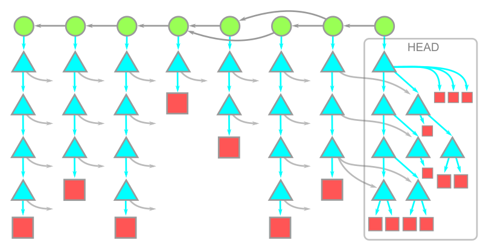

# 高阶-Git原理

> 前置知识：
>
> * [进阶-Git的分支管理](./branch.md)

## Hash

Git的设计围绕着hash（哈希）的概念。考虑一类函数$\{H(\cdot)\}$，它们可以将任意长度的数据映射到一个固定大小的空间上（这个空间一般很小）。对于$H(\cdot)$，如果我们很难[^1]找到两个输入的数据$a$和$b$使得$H(a)=H(b)$，那么称$H$是一个hash function。

Git的假设是，任意两个文件的hash不相同，我们用它们的hash作为它们的唯一名字。你可能会不服，假如说hash的输出为$32$个bit，那么hash总共只有$2^{32}$种。但是长度为$33$的文件有$2^{33}$个，根据鸽巢原理，必然会有文件冲突。没错，你说的对。

但是很遗憾，人脑在指数级的数据上并不是那么敏感。Git目前采用的hash function为SHA256，输出是256个bit，如果我们假定这个hash function的输出是纯随机的，那么平均$2^{256}$个文件才会有一次冲突。地球的原子数量估算在$1.3\times10^{50}\approx 2^{166}$，把地球上每个原子都当成一个文件存进git里面，冲突的概率为$10^{-27}$，这仍然是一个几乎是不可能的概率。目前我们仍未找到任何一例SHA256冲突[^2]，世界上最大的SHA256计算器——比特币矿池，每日计算$10^{11}$次SHA256。[^3]

[^1]: 如果两个随机的数据$a$和$b$有大概率$H(a)\ne H(b)$，那么$H$仅仅是一个校验函数，而不满足哈希函数的要求。“很难”的定义在密码学里给出。
[^2]: 一些老的算法如MD5和SHA1已经存在人工构造的冲突。
[^3]: https://cryptoquant.com/asset/btc/chart/network-stats/hashrate

## Tree

在git的仓库里面，一个文件被称为一个blob(binary large object)。除了blob外，仓库内有一类特殊的对象叫tree，一个tree代表一个文件夹，它在git中存储的格式如下：

```
100644 blob a906cb2a4a904a152e80877d4088654daad0c859      README
100644 blob 8f94139338f9404f26296befa88755fc2598c289      Rakefile
040000 tree 99f1a6d12cb4b6f19c8655fca46c3ecf317074e0      lib
```

中间的一长串数字和字母就代表这个文件的hash。我们在前一节假设，每个文件的hash都不相同，因此只要给定了hash，就可以确定具体是哪个文件。这里的hash也可以指向一个另一个文件夹，表示文件夹中的文件夹。

根据hash的特性，如果文件夹中的任何文件发生变动，文件的hash会改变，tree的hash也会被改变，因此确定了tree的hash就同时确定了文件夹中所有文件的内容。反之，如果两个文件的内容完全相同，那么hash也相同，tree会指向同一个文件，因此文件只需要存储一次。这个特性保证我们在创建一个新的版本的时候，只需要存储改动过的文件。


这个结构被称为Merkle Tree，在文件系统和区块链中有广泛的应用。

## Commit

Git中还有一类特殊的对象叫commit，它包含了每次commit的作者、备注、时间的信息，最重要的是，它包含了本次commit的tree hash和上一个commit的hash。因此，我们只要获得了commit hash，我们就可以保证git仓库内的所有文件，以及所有的历史都没有错误，也没有被篡改过。这也是为什么git很难修改历史，因为一旦发生任何修改，所有的hash都会发生变化，需要重新计算。这是一种有效的验证安全的办法，在证书信任链中也有类似的技巧。

## 结语

本文介绍的所有hash指针构成以下有向无环图：


<br>
<small>图源：[GitHub](https://github.blog/2020-12-21-get-up-to-speed-with-partial-clone-and-shallow-clone/)</small>

Git在实际存储的时候，会默认对blob进行压缩；对于较大的文件会跨版本压缩，减少重复空间使用量；对于比较多的小文件，会合并入一个packfile中以提升读写性能。

Git的设计不容易出现*版本号*冲突，非常适合协作，每个branch都只需要存储一个commit hash。不过，Git当前最大的局限性是对文件数量多的仓库和大文件支持不好。
